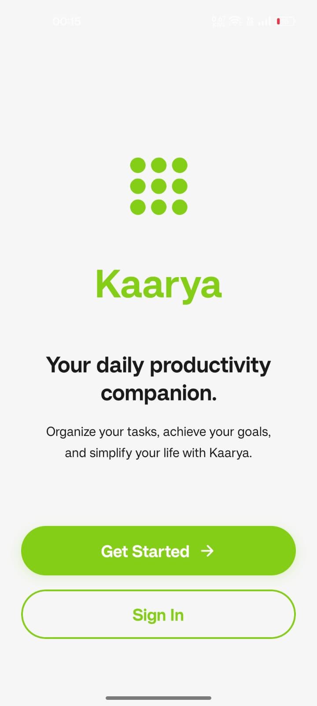
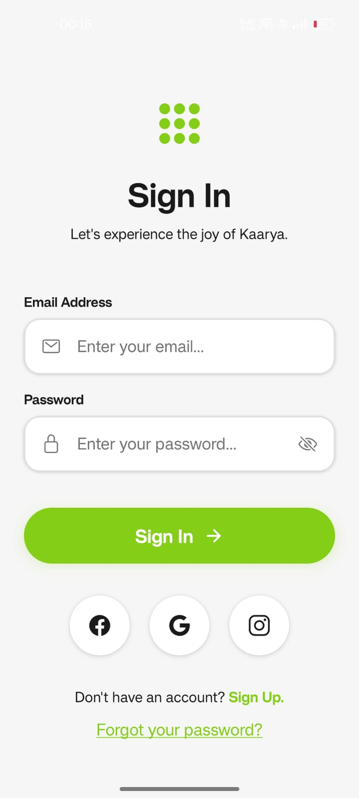
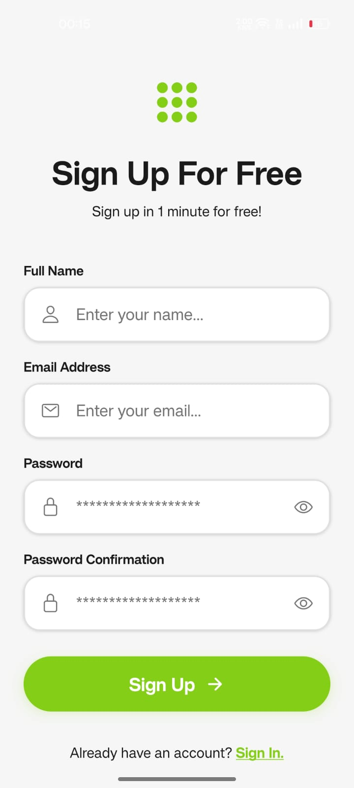
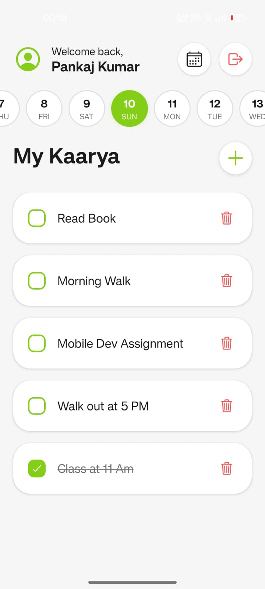
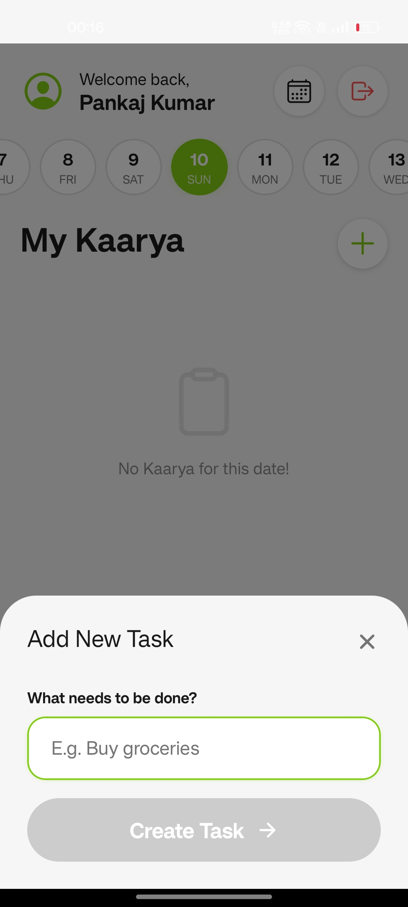
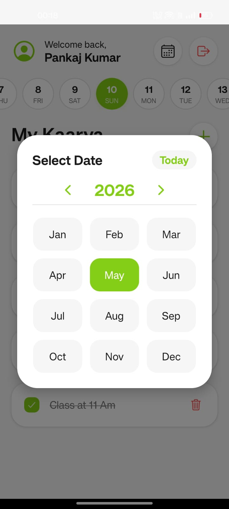

# Kaarya — Manage your Day

Kaarya is a task management application built with React Native and Expo. It features a local-first architecture using SQLite for data persistence.

## Features

- **Secure Authentication**: Full sign-up and login flow with local user persistence.
- **Smart Calendar**: 
  - Dynamic horizontal date selector.
  - Full Month & Year picker for long-term planning.
  - Automatic synchronization with the current date.
- **Task Management**: 
  - Create, toggle, and delete tasks for any specific date.
  - Persistent storage using SQLite.
- **Local-First Architecture**: 
  - SQLite Database: Local relational storage.
  - AsyncStorage: Session management to keep users logged in.

## Screenshots

<div align="center">
  <p align="center">
    
    
    
  </p>
  <p align="center">
    
    
    
  </p>
  <p align="center">
    
  </p>
</div>

## Getting Started

### Prerequisites

- Node.js (v18 or newer)
- npm or yarn
- Expo Go app on your mobile device

### Installation

1. **Clone the repository**:
   ```bash
   git clone https://github.com/PankajKumar1947/Kaarya-Manage-your-Day
   cd Kaarya-Manage-your-Day
   ```

2. **Install dependencies**:
   ```bash
   npm install
   ```

3. **Start the development server**:
   ```bash
   npm start
   ```

4. **Run on your device**:
   Scan the QR code with your Expo Go app (Android) or Camera app (iOS).

## Project Structure

- `src/app`: File-based routing using Expo Router.
- `src/components`: Reusable UI components.
- `src/context`: State management for Authentication and Todos.
- `src/services`: Business logic and database interaction layer.
- `src/db`: SQLite schema definitions and migrations.
- `src/hooks`: Custom React hooks.
- `src/theme`: Centralized color palette and design tokens.

## Tech Stack

- **Framework**: Expo / React Native
- **Navigation**: Expo Router
- **Database**: expo-sqlite
- **Persistence**: @react-native-async-storage/async-storage
- **Icons**: Ionicons
- **Styling**: StyleSheet

## License

This project is licensed under the MIT License.

---

Built by [Pankaj Kumar](https://github.com/PankajKumar1947)
